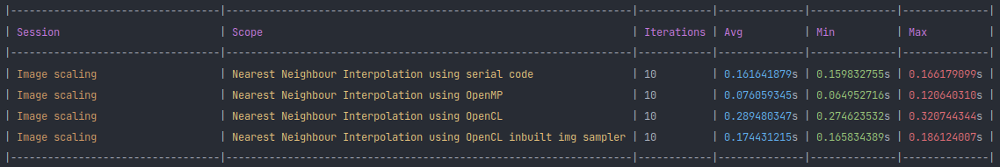

# Image Processing

- [Image Processing](#image-processing)
  - [Nearest neighbour interpolation image scaling](#nearest-neighbour-interpolation-image-scaling)
    - [Serial Implementation](#serial-implementation)
    - [OpenMP Implementation](#openmp-implementation)
    - [OpenCL Implementation](#opencl-implementation)
  - [Output](#output)
  - [Home](../README.md#serialvsparallel)


## Nearest neighbour interpolation image scaling

- [What is nearest neighbour interpolation?](https://theailearner.com/2018/12/29/image-processing-nearest-neighbour-interpolation/)


### Serial Implementation

- It's a simple algorithm with 2 nested loops
- We calculate the pixel value at `scaledI, scaledJ` in the scaled image `scaledImage.at<uint32_t>(scaledI, scaledJ)` by getting the nearest neighbour from the original image `image.at<uint32_t>(scaledI/scaleY, scaledJ/scaleX)`

```cpp
#include <opencv2/opencv.hpp>

cv::Mat transform(const cv::Mat &image, float scaleX, float scaleY) {
    auto channelSize = image.channels();
    cv::Mat scaledImage(std::round(image.rows * scaleY), std::round(image.cols * scaleX), CV_8UC(channelSize));

    for(int32_t scaledI = 0; scaledI < scaledImage.rows; ++scaledI) {
        for(int32_t scaledJ = 0; scaledJ < scaledImage.cols; ++scaledJ) {
            //4 "8-bit" channels -> 32 bits
            scaledImage.at<uint32_t>(scaledI, scaledJ) = image.at<uint32_t>(scaledI/scaleY, scaledJ/scaleX);
        }
    }

    return scaledImage;
}
```

### OpenMP Implementation

- We add a scheduled `#pragma omp for` on the outermost loop.

```cpp
#include <omp.h>
#include <opencv2/opencv.hpp>

cv::Mat transform(const cv::Mat &image, float scaleX, float scaleY) {
    omp_set_num_threads(omp_get_max_threads());
    auto channelSize = image.channels();
    cv::Mat scaledImage(std::round(image.rows * scaleY), std::round(image.cols * scaleX), CV_8UC(channelSize));

    #pragma omp parallel for schedule(static) default(none) firstprivate(scaleX, scaleY) shared(image, scaledImage)
    for(int32_t scaledI = 0; scaledI < scaledImage.rows; ++scaledI) {
        for(int32_t scaledJ = 0; scaledJ < scaledImage.cols; ++scaledJ) {
            //4 "8-bit" channels -> 32 bits
            scaledImage.at<uint32_t>(scaledI, scaledJ) = image.at<uint32_t>(scaledI/scaleY, scaledJ/scaleX);
        }
    }

    return scaledImage;
}
```

### OpenCL Implementation

- Work-item: the body of inner most loop, i.e., `scaledImage.at<uint32_t>(scaledI, scaledJ) = image.at<uint32_t>(scaledI/scaleY, scaledJ/scaleX);`
- Global work size dimensions: dimension(scaled image) at the least or bigger
- Local work size dimensions: no restrictions.
- We have implemented the kernel in 2 ways.
    1. We treated the image pixels like an array of chars.
    2. We used OpenCL's inbuilt image sampler to read, process and write the pixel data.

1. Kernel code:

```c
__kernel void nearestNeighbourInterpolation(
    __constant uchar *image,
    const size_t imageStride,
    __global uchar *scaledImage,
    const uint scaledImageRows,
    const uint scaledImageCols,
    const size_t scaledImageStride,
    const size_t channelSize,
    const float imageScaleX,
    const float imageScaleY
) {
    size_t scaledI = get_global_id(0), scaledJ = get_global_id(1);
    if(scaledImageRows <= scaledI || scaledImageCols <= scaledJ) return;
    size_t scaledImageOffset = scaledI*scaledImageStride + scaledJ*channelSize;

    size_t i = scaledI/imageScaleY, j = scaledJ/imageScaleX;
    size_t imageOffset = i*imageStride + j*channelSize;

    for(size_t channel = 0; channel < channelSize; ++channel) {
        scaledImage[scaledImageOffset + channel] = image[imageOffset + channel];
    }
}
```

2. Kernel code:

```c
__constant sampler_t nnSampler =    CLK_NORMALIZED_COORDS_FALSE |
                                    CLK_ADDRESS_NONE |
                                    CLK_FILTER_NEAREST;

__kernel void nearestNeighbourInterpolation2(
    __read_only image2d_t image,
    __write_only image2d_t scaledImage,
    const uint scaledImageRows,
    const uint scaledImageCols,
    const float imageScaleX,
    const float imageScaleY
) {
    // column major indexing
    int2 scaledImageCoord = (int2)(get_global_id(1), get_global_id(0));
    if(scaledImageRows <= scaledImageCoord.x || scaledImageCols <= scaledImageCoord.y) return;
    int2 imageCoord = (int2)(scaledImageCoord.x/imageScaleX, scaledImageCoord.y/imageScaleY);

    uint4 pixel = read_imageui(image, nnSampler, imageCoord);
    write_imageui(scaledImage, scaledImageCoord, pixel);
}
```

## Output


