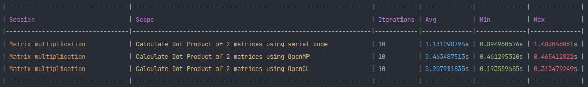

# Matrix Multiplication

- [Matrix Multiplication](#matrix-multiplication)
  - [Serial Implementation](#serial-implementation)
  - [OpenMP Implementation](#openmp-implementation)
  - [OpenCL Implementation](#opencl-implementation)
  - [Output](#output)
  - [Home](../README.md#serialvsparallel)

## Serial Implementation

- It's a simple algorithm with 3 nested loops.
- To get the value at `result[i][j]`, the innermost loop calculates the dot product between *i'th* row of `matrix1` and *j'th* column of `matrix2`.

```cpp
#include <vector>

using Matrix = std::vector<std::vector<float>>;
using MatrixElementType = Matrix::value_type::value_type;

void calculateDotProduct(const Matrix &matrix1, const Matrix &matrix2, Matrix &result) {
    for(size_t i = 0; i < matrix1.size(); ++i) {
        for(size_t j = 0; j < matrix2[0].size(); ++j) {
            result[i][j] = MatrixElementType(0);
            for(size_t k = 0; k < matrix2.size() /*or matrix1[0].size() */; ++k) {
                result[i][j] += matrix1[i][k] * matrix2[k][j];
            }
        }
    }
}
```

## OpenMP Implementation

- The outer most has the default `#pragma omp` for-loop directive.
- Parallelizing inner loops gives pretty bad performance, since threads get spawned and killed multiple no. of times, leading to a large overhead.
- The code snippet below has commented out the `#pragma omp` directives for the inner loops.
  - To test the hypothesis, try uncommenting the `#pragma omp` directive for 2nd loop. The code will slow, but it will still give correct result.
  - The `#pragma omp` for the innermost loop, if used, leads to a data race condition, since multiple threads will make write attempts at `result[i][j]`.

```cpp
#include <vector>

using Matrix = std::vector<std::vector<float>>;
using MatrixElementType = Matrix::value_type::value_type;

void calculateDotProduct(const Matrix &matrix1, const Matrix &matrix2, Matrix &result) {
    omp_set_num_threads(omp_get_num_procs());
    #pragma omp parallel for default(none) shared(matrix1, matrix2, result)
    for(size_t i = 0; i < matrix1.size(); ++i) {
        //#pragma omp parallel for default(none) firstprivate(i) shared(matrix1, matrix2, result)
        for(size_t j = 0; j < matrix2[0].size(); ++j) {
            // Apart from being stupidly slow, this has a race condition
            //#pragma omp parallel for default(none) firstprivate(i, j) shared(matrix1, matrix2, result)
            result[i][j] = MatrixElementType(0);
            for(size_t k = 0; k < matrix2.size() /*or matrix1[0].size() */; ++k) {
                result[i][j] += matrix1[i][k] * matrix2[k][j];
            }
        }
    }
}
```

## OpenCL Implementation

- Work-item: the whole innermost for loop
  - why not just the body of the innermost loop, i.e., just the `result[i][j] += matrix1[i][k] * matrix2[k][j];`? Because in that case, we need to make atomic writes at `result[i][j]`, and OpenCL 1.2 specs doesn't support atomic_add for floats 
- Global work size dimensions: dimension(resultant matrix) at the least or bigger
- Local work size dimensions: no restrictions.
  - by default choose sqrt(CL_DEVICE_MAX_WORK_GROUP_SIZE), for the 1st and 2nd local work dimension
  - then set the global work dimension as a multiple of local work dimensions, such that they are just greater than or equal to the dimensions of the resultant matrix

Kernel code:

```c
__kernel void calculateDotProduct(__global float *matrix1, __global float *matrix2, __global float *result, __const size_t m, __const size_t n, __const size_t p) {
    __private size_t x = get_global_id(0);
    __private size_t y = get_global_id(1);

    if(m <= x || p <= y) return;

    __private float temp = 0.f;
    for(size_t k = 0; k < n; ++k) {
        temp += matrix1[x*n + k] * matrix2[k*p + y];
    }
    result[x*p + y] = temp;
}
```

## Output


