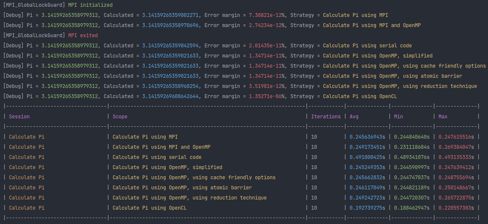

# Pi

- [Pi](#pi)
  - [Serial Implementation](#serial-implementation)
  - [OpenMP Implementation](#openmp-implementation)
    - [Simple OpenMP implementation](#simple-openmp-implementation)
    - [Cache friendly](#cache-friendly)
    - [Atomics](#atomics)
    - [Reduction](#reduction)
  - [MPI Implementation](#mpi-implementation)
  - [MPI OpenMP Hybrid Implementation](#mpi-openmp-hybrid-implementation)
  - [Output](#output)
  - [Home](../README.md#serialvsparallel)

- &space;=&space;\pi)
- ^2}*\frac{1}{N})
  - N = steps
- We are using this particular integral over others because of the simplicity of the summation. for e.g. we could have used  (area under the circle) but this involves finding squareroots, which is another non trival task in itself.

## Serial Implementation

```cpp
#include <cstdint>

double calculatePi(uint32_t steps) {
    const double delta = 1.0 / steps;
    double area = 0.0;

    for(uint32_t step = 0; step < steps; ++step) {
        double x = (step + 0.5) * delta;
        area += 4.0 / (1.0 + x*x);
    }

    return area * delta;
}
```

## OpenMP Implementation

- [Ripped off from this awsome tutorial by Tim Mattson on youtube](https://www.youtube.com/watch?v=nE-xN4Bf8XI&list=PLLX-Q6B8xqZ8n8bwjGdzBJ25X2utwnoEG)
- 4 different implementations using OpenMP directives
  - reduction is my favourite one due to it's simplicity

### Simple OpenMP implementation

- Store sum of each thread in a different location to avoid data race.
- [Tim Mattson's lecture for reference](https://www.youtube.com/watch?v=OuzYICZUthM&list=PLLX-Q6B8xqZ8n8bwjGdzBJ25X2utwnoEG&index=7)

```cpp
#include <cstdint>
#include <numeric>
#include <omp.h>
#include <vector>

double calculatePi(uint32_t steps) {
    const double delta = 1.0 / steps;
    std::vector<double> area(omp_get_max_threads(), 0.0);

    omp_set_num_threads(omp_get_max_threads());
    #pragma omp parallel default(none) firstprivate(steps, delta) shared(area)
    {
        auto totalThreads = omp_get_num_threads();
        auto threadID = omp_get_thread_num();
        for(uint32_t step = threadID; step < steps; step+=totalThreads) {
            double x = (step + 0.5) * delta;
            area[threadID] += 4.0 / (1.0 + x*x);
        }
    }

    return std::accumulate(area.begin(), area.end(), 0.0) * delta;
}
```

### Cache friendly

- Same as the above implementation, except store the area at intervals `CACHE_PADDING`, to **false sharing**.
- [Tim Mattson's lecture for reference](https://www.youtube.com/watch?v=OuzYICZUthM&list=PLLX-Q6B8xqZ8n8bwjGdzBJ25X2utwnoEG&index=7)

```cpp
#include <cstdint>
#include <omp.h>

#define CACHE_PADDING 8

double calculatePi(uint32_t steps) {
    const double delta = 1.0 / steps;
    uint32_t maxThreadsPossible = omp_get_max_threads();
    double area[maxThreadsPossible][CACHE_PADDING];
    for(uint32_t i = 0; i < maxThreadsPossible; ++i) {
        area[i][0] = 0;
    }

    omp_set_num_threads(omp_get_max_threads());
    #pragma omp parallel default(none) firstprivate(steps, delta) shared(area)
    {
        auto totalThreads = omp_get_num_threads();
        auto threadID = omp_get_thread_num();
        for(uint32_t step = threadID; step < steps; step+=totalThreads) {
            double x = (step + 0.5) * delta;
            area[threadID][0] += 4.0 / (1.0 + x*x);
        }
    }

    double totalArea = 0.0;
    for(uint32_t i = 0; i < maxThreadsPossible; ++i) {
        totalArea += area[i][0];
    }

    return totalArea * delta;
}
```

### Atomics

- Store sum in one variable only. To avoid data race conditions, we can declare the code-section as **critical** or **atomic**.
- [Tim Mattson's lecture for reference](https://www.youtube.com/watch?v=pLa972Rgl1I&list=PLLX-Q6B8xqZ8n8bwjGdzBJ25X2utwnoEG&index=9)

```cpp
#include <cstdint>
#include <omp.h>

double calculatePi(uint32_t steps) {
    const double delta = 1.0 / steps;
    double area = 0.0;

    omp_set_num_threads(omp_get_max_threads());
    #pragma omp parallel default(none) firstprivate(steps, delta) shared(area)
    {
        auto totalThreads = omp_get_num_threads();
        double area_t = 0.0;
        for(uint32_t step = omp_get_thread_num(); step < steps; step+=totalThreads) {
            double x = (step + 0.5) * delta;
            area_t += 4.0 / (1.0 + x*x);
        }
    #pragma omp atomic
        area += area_t;
    }

    return area * delta;
}
```
### Reduction

- Use OpenMP's in built reduction technique
- [Tim Mattson's lecture for reference](https://www.youtube.com/watch?v=8jzHiYo49G0&list=PLLX-Q6B8xqZ8n8bwjGdzBJ25X2utwnoEG&index=12)

```cpp
#include <cstdint>
#include <omp.h>

double calculatePi(uint32_t steps) {
    const double delta = 1.0 / steps;
    double area = 0.0;

    omp_set_num_threads(omp_get_max_threads());
    #pragma omp parallel for reduction(+:area) default(none) firstprivate(steps, delta)
    for(uint32_t step = 0; step < steps; ++step) {
        double x = (step + 0.5) * delta;
        area += 4.0 / (1.0 + x*x);
    }

    return area * delta;
}
```

## MPI Implementation

- Like OpenMP, MPI also provides reduce functionality
- Each process will calculate it's partial sum, and we will sum it up in the end using `MPI_Reduce` api
- Compile `mpic++ -o pi <source-file>`
- Run the executable `mpirun -np 4 ./pi`

```cpp
#include <cstdint>
#include <mpi/mpi.h>

double calculatePi(uint32_t steps) {
    double pi = 0.0;
    double delta = 1.0 / steps;
    double area = 0.0;

    int32_t processId, noOfProcesses;
    MPI_Comm_size(MPI_COMM_WORLD, &noOfProcesses);
    MPI_Comm_rank(MPI_COMM_WORLD, &processId);

    for (size_t step = processId; step < steps; step += noOfProcesses) {
        double x = (step + 0.5) * delta;
        area += 4.0 / (1.0 + x*x);
    }
    area *= delta;

    MPI_Reduce(&area, &pi, 1, MPI_DOUBLE, MPI_SUM, 0, MPI_COMM_WORLD);

    return pi;
}

int main(int argc, char **argv) {
    if(MPI_Init(&argc, &argv) != MPI_SUCCESS) return 0;
    printf("Pi = %f\n", calculatePi(1e8));
    MPI_Finalize();

    return 0;
}
```

## MPI OpenMP Hybrid Implementation

- Use openmp to parallelize the partial sum calculation in each process
- Compile ` mpic++ -o pi -fopenmp <source-file>`
- Run the executable `mpirun -np 4 ./pi`

```cpp
#include <cstdint>
#include <mpi/mpi.h>
#include <omp.h>

double calculatePi(uint32_t steps) {
    double pi = 0.0;
    double delta = 1.0 / steps;
    double area = 0.0;

    int32_t processId, noOfProcesses;
    MPI_Comm_size(MPI_COMM_WORLD, &noOfProcesses);
    MPI_Comm_rank(MPI_COMM_WORLD, &processId);

    omp_set_num_threads(omp_get_max_threads());
    #pragma omp parallel for reduction(+:area) default(none) firstprivate(steps, delta, processId, noOfProcesses)
    for (size_t step = processId; step < steps; step += noOfProcesses) {
        double x = (step + 0.5) * delta;
        area += 4.0 / (1.0 + x*x);
    }
    area *= delta;

    MPI_Reduce(&area, &pi, 1, MPI_DOUBLE, MPI_SUM, 0, MPI_COMM_WORLD);

    return pi;
}

int main(int argc, char **argv) {
    if(MPI_Init(&argc, &argv) != MPI_SUCCESS) return 0;
    printf("Pi = %f\n", calculatePi(1e8));
    MPI_Finalize();

    return 0;
}
```

## Output



TODOs:

- [ ] OpenCL
- [x] MPI
- [x] MPI OpenMP Hybrid
